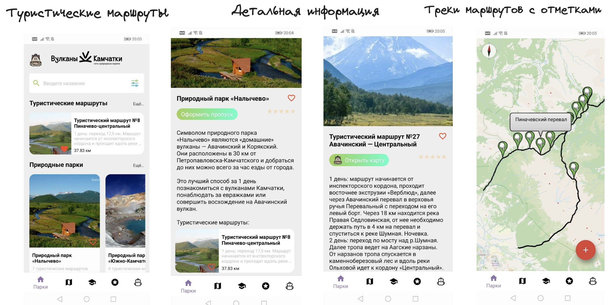
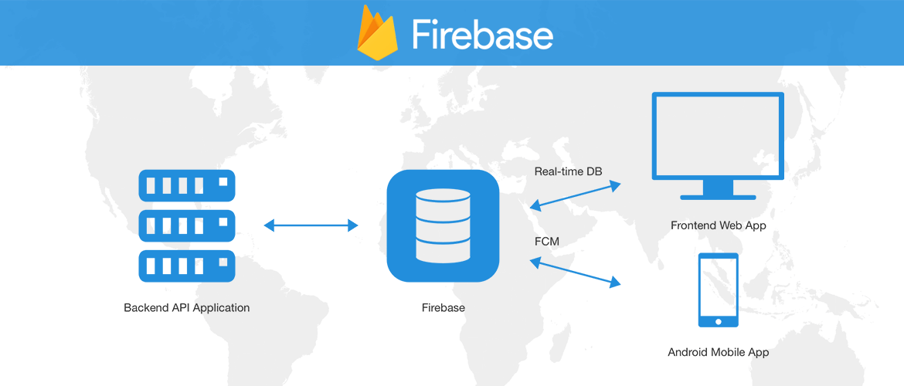
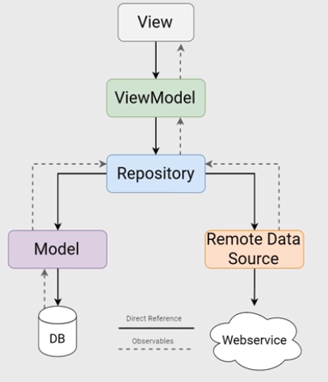

# Проект для Хакатона
Это проект, выполненный в рамках хакатона Лидеры цифровой трансформации
Задача №25

## Видео Демонстрация проекта 📌
[Видео](https://youtu.be/qCj4mewr1jU)

## Презентация проекта 📚:
[Презентация](https://docs.google.com/presentation/d/1FRT9H5mPspcZYXGgfjj2hiIF1NQcYn9SkaaIKz2Ufb0/edit?usp=sharing)

## Приложение позволяет пользователю:

- Оформить пропуск через Госуслуги
- Получить информацию о туристических маршрутах (GPS-трек, места стоянок, старт и финиш маршрута, протяженность)
- Просматривать детальную информацию о загруженности маршрута
- Добавлять в избранное понравившиеся маршруты
- Сообщить о нарушении на маршруте, отправить заявку
- Следить за антропогенной нагрузкой Камчатского края
- Получить советы по подготовке к походу

## Демонстрация проекта 📌:

## APK проекта для скачивания 📚:
[Ссылка на APK](https://drive.google.com/file/d/1W8OuZ7MY9xU7Xfffo-rj9wZfyZdz1HB2/view?usp=sharing)

## Архитектура проекта:
- Приложение разработано в связке Firebase + Android SDK
- Карты на основе OpenStreetMap

## Ключевые особенности проекта:
- Карта треков (в том числе и офлайн) и отметки
- Поиск маршрутов и возможность добавить в избранное
- Расчет антропогенной нагрузки и отображение нагрузки на маршруте
- Возможность сообщить о нарушении

## В проекте используются следующие библиотеки и фрэймворки:
- Создан модуль для UI Kit, хранящий основные UI-компоненты Android-приложения: SearchBar, Colors, Items
- Groupie для построения сложных списков на базе RecyclerView. [Ссылка](https://github.com/lisawray/groupie)
- Android Navigation для навигации между экранами. [Подробнее](https://developer.android.com/guide/navigation/navigation-getting-started)
- [ViewPager 2.0](https://developer.android.com/training/animation/vp2-migration)
- KtLint для поддержания Kotlin Code Style. [Подробнее](https://github.com/pinterest/ktlint)

## Установка:
- Для установки достаточно скачать zip-архив ИЛИ скачать APK-ниже
- Распаковать
- Открыть с помощью Android Studio 
- Подключить Android-устройство и нажать кнопку Run
- ВНИМАНИЕ! Ключ от Яндекс карт находится в gitignore в целях безопасности. Используйте свой ключ или обратитесь к команде

## Демонстрация проекта 📚:
[Видео](https://youtu.be/qCj4mewr1jU)

## APK проекта для скачивания 📚:
[Ссылка на APK](https://drive.google.com/file/d/1W8OuZ7MY9xU7Xfffo-rj9wZfyZdz1HB2/view?usp=sharing)

